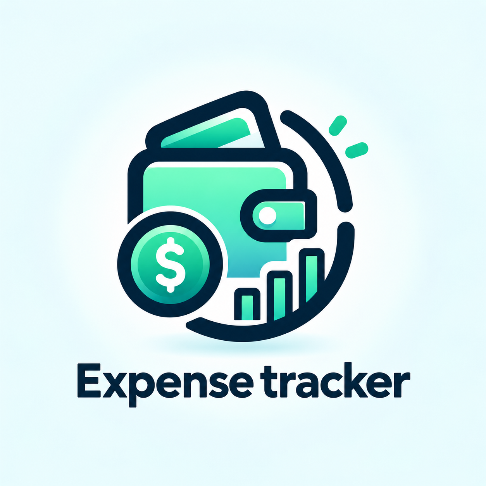

# Personal Expense Tracker

<p align="center">
  
</p>

A responsive personal finance tracking application built using React, Tailwind CSS, React Router, and Recharts.

The application allows users to record income and expenses, automatically calculate their financial balance, review transaction history, search, filter and sort transactions, set monthly category budgets, compare income and expenses visually, and open separate Income and Expense statement pages.

> Current storage: transactions and budgets are saved in the browser's localStorage, so the data stays available after refreshing the page.

---

## Features

### Currently Implemented

## Dashboard

The main dashboard provides a quick overview of the user's financial activity.

The dashboard displays:

- Total Balance
- Total Income
- Total Expenses
- Income vs Expense chart
- Recent transaction history
- Transaction search and date sorting
- Add Entry action

The current balance is calculated using:

```text
Balance = Total Income - Total Expenses
```

The financial summary automatically updates whenever a transaction is added or deleted.

---

## Financial Summary Cards

The dashboard contains three financial summary cards:

### Total Balance

Displays the user's current balance.

```text
Balance = Income - Expenses
```

### Income

Displays total recorded income.

The Income card is clickable and opens the detailed Income Statement page:

```text
/income
```

### Expenses

Displays total recorded expenses.

The Expense card is clickable and opens the detailed Expense Statement page:

```text
/expenses
```

---

## Quick Add Transaction Panel

Transactions are added using a compact Quick Add interface instead of a permanently visible form.

The user clicks:

```text
+ Add entry
```

to open the transaction panel.

### Quick Add Features

- Money Out / Money In transaction selector
- Large amount input
- Different categories for income and expenses
- Selectable category cards
- Description input
- Date selection
- Current date selected automatically
- Positive amount validation
- Required category validation
- Required description validation
- Required date validation
- Record Expense button
- Record Income button
- Cancel button
- Close button
- Automatic form reset after submission

If the panel is closed before submitting, the unfinished entry remains available during the current page session.

---

## Transaction Categories

Expense categories currently include options such as:

- Food
- Transport
- Shopping
- Bills
- Entertainment
- Health
- Education
- Other

Income categories currently include:

- Salary
- Freelance
- Gift
- Other

---

## Transaction History

The application displays recorded transactions in the dashboard.

Each transaction contains:

- Description
- Category
- Date
- Transaction type
- Amount
- Income or Expense indicator
- Delete button

Additional functionality:

- Transactions can be searched by description or category.
- Transactions can be filtered by category on the statement pages.
- Transactions can be sorted by date, newest or oldest first.
- Income transactions use income styling.
- Expense transactions use expense styling.
- Newly created transactions appear at the top of the list.
- Individual transactions can be deleted.
- Transaction totals update automatically after deletion.
- The Finance Chart also updates automatically.
- Transaction count is displayed.
- An empty state appears when no transactions exist.

---

## Search, Filter, and Sort Transactions

The transaction list on the dashboard, Income Statement, and Expense Statement includes a search box and a date sorting toggle. The Income and Expense statement pages also provide a category filter dropdown.

The search filters transactions by:

- Description
- Category

### Search Behavior

- Filters transactions by description or category.
- The search is case-insensitive.
- Partial matches are supported, so typing `gro` finds `Grocery shopping`.
- Results update instantly while typing.
- A clear button (✕) inside the search box removes the search text.

### Category Filter

- Available on the Income Statement and Expense Statement pages.
- The dropdown options are built from the categories actually present in the transactions, so the Income page only offers income categories and the Expense page only offers expense categories.
- Selecting a category shows only its transactions, and `All categories` restores the full list.
- Works together with the search box.

### Date Sorting

- A `Newest first` / `Oldest first` toggle sorts transactions by date.
- Newest first is the default.
- Transactions sharing the same date keep a stable order.

### Combined Filters

- Search, category filter, and sorting can be combined.
- While a filter is active, the list shows `Showing X of Y transactions`.
- A `Clear filters` link resets the search and the category filter.
- If nothing matches, a "No matching transactions" state is displayed with a `Clear filters` button.

Example:

```text
Page:    Expense Statement
Filter:  Food
Sort:    Newest first

Shows only Food expenses, most recent first.
```

---

## Monthly Budgets Page

The Budgets page allows users to set a monthly spending limit for each expense category.

Route:

```text
/budgets
```

The Budgets page displays:

- Total Budget across all categories
- Total Spent this month in budgeted categories
- Remaining budget for the month
- One budget card per category
- A budget creation form

### Budget Card

Each budget card shows:

- Budget category
- Monthly limit
- Amount already spent this month
- Progress bar with color status:

```text
Green  = below 75% of the limit
Amber  = 75% - 89% of the limit
Red    = 90% and above
```

- Status badge: On track, Watch spending, Almost at limit, or Budget exceeded
- Remaining amount, or the amount over budget
- Delete button with confirmation

Spending is calculated automatically from the expense transactions of the current month.

### Budget Rules

- Only expense categories can have budgets.
- A category can only have one budget at a time.
- Budget limits must be greater than 0.
- Budgets are stored in localStorage.

---

## Data Persistence (localStorage + useEffect)

Transactions and budgets are automatically saved to the browser's localStorage.

The flow is:

```text
React State
    |
    v
useEffect
    |
    v
localStorage
    |
    v
Browser Refresh
    |
    v
Restore Transactions and Budgets
```

Storage keys:

```text
expenseTrackerTransactions
expenseTrackerBudgets
```

If saved data cannot be parsed, the application starts with an empty list instead of crashing.

---

## Income vs Expense Chart

The dashboard contains an interactive donut chart built using **Recharts**.

The chart compares the user's total income and total expenses.

### Chart Colors

```text
Green = Income
Blue  = Expense
```

### Chart Features

- Displays Income and Expense in a donut chart.
- Shows the current balance in the center.
- Updates automatically whenever transactions change.
- Hovering over a chart section displays the related amount.
- No unnecessary click-selection box is displayed.
- Responsive on desktop, tablet, and mobile.
- Shows a visual placeholder before transaction data exists.

Example:

```text
Income:  NPR 2,500.00
Expense: NPR 500.00

Balance: NPR 2,000.00
```

---

## Multi-Page Navigation

The project uses **React Router DOM** to provide client-side navigation.

Available routes:

```text
/
Dashboard
```

```text
/income
Income Statement
```

```text
/expenses
Expense Statement
```

```text
/budgets
Monthly Budgets
```

The application changes pages without completely reloading the browser.

---

## Income Statement Page

The Income card on the dashboard opens the Income Statement page.

Route:

```text
/income
```

The Income Statement page displays:

- Total Income
- Number of income transactions
- Transaction date
- Description
- Category
- Amount
- Complete income transaction history
- Category filter dropdown
- Newest/Oldest date sorting
- Back to Dashboard navigation

Only transactions where:

```js
transaction.type === "income"
```

are displayed on this page.

---

## Expense Statement Page

The Expense card on the dashboard opens the Expense Statement page.

Route:

```text
/expenses
```

The Expense Statement page displays:

- Total Expenses
- Number of expense transactions
- Transaction date
- Description
- Category
- Amount
- Complete expense transaction history
- Category filter dropdown
- Newest/Oldest date sorting
- Back to Dashboard navigation

Only transactions where:

```js
transaction.type === "expense"
```

are displayed on this page.

---

## Application Logo

The application uses a custom Expense Tracker logo (a wallet with a coin and growth bars) stored inside:

```text
src/assets/finance-tracker-logo.png
```

A copy of the same image is served from:

```text
public/logo.png
```

The logo is used in two places:

1. **Sidebar brand area** — The logo is imported into `Sidebar.jsx` and displayed inside the dark desktop sidebar, next to the ExpenseFlow application name.
2. **Browser favicon** — The `index.html` file references `/logo.png`, so the logo appears on the browser tab.

The logo is imported into the React component so Vite bundles it and provides a hashed URL automatically.

---

## Responsive Design

The application is designed to work across:

- Desktop
- Laptop
- Tablet
- Mobile phone

### Desktop Layout

On larger screens:

- Financial summary cards are displayed horizontally.
- Add Entry appears near the dashboard heading.
- Finance chart receives more horizontal space.
- Transaction history uses the available page width.
- Income and Expense statement information is displayed clearly.

### Mobile Layout

On smaller screens:

- Total Balance uses a full-width card.
- Income and Expense cards appear underneath.
- Add Entry is easily accessible.
- Quick Add becomes mobile-friendly.
- Inputs use mobile-safe font sizes.
- Transaction rows adapt to smaller screens.
- Finance chart resizes responsively.
- Buttons are touch-friendly.
- Horizontal page overflow is prevented.

---

## Technologies Used

The project currently uses:

- React
- JavaScript
- JSX
- Tailwind CSS
- Vite
- React Router DOM
- Recharts
- HTML
- CSS
- Git
- GitHub

---

## Project Structure

Expense_tracking/
|
|-- node_modules/
|
|-- public/
|   |-- favicon.svg
|   |-- icons.svg
|   `-- logo.png
|
|-- src/
|   |
|   |-- assets/
|   |   |-- finance-tracker-logo.png
|   |   |-- hero.png
|   |   |-- react.svg
|   |   `-- vite.svg
|   |
|   |-- components/
|   |   |-- AppLayout.jsx
|   |   |-- BudgetCard.jsx
|   |   |-- BudgetForm.jsx
|   |   |-- FinanceChart.jsx
|   |   |-- Header.jsx
|   |   |-- Sidebar.jsx
|   |   |-- SummaryCards.jsx
|   |   |-- TransactionForm.jsx
|   |   |-- TransactionItem.jsx
|   |   `-- TransactionList.jsx
|   |
|   |-- pages/
|   |   |-- BudgetsPage.jsx
|   |   |-- Dashboard.jsx
|   |   |-- ExpensePage.jsx
|   |   `-- IncomePage.jsx
|   |
|   |-- App.css
|   |-- App.jsx
|   |-- index.css
|   `-- main.jsx
|
|-- .gitignore
|-- eslint.config.js
|-- index.html
|-- package-lock.json
|-- package.json
|-- README.md
`-- vite.config.js


> Important: The component directory is named `components` with a lowercase `c`. Import paths must use the same capitalization.


## Component Responsibilities

| File | Responsibility |
| --- | --- |
| `App.jsx` | Stores transaction state, adds and deletes transactions, calculates totals, and defines routes. |
| `Header.jsx` | Displays the dashboard title, current month, and Add Transaction button. |
| `SummaryCards.jsx` | Displays Balance, Income, and Expenses. Income and Expense cards navigate to statement pages. |
| `TransactionForm.jsx` | Provides the Quick Add transaction interface and handles form state and validation. |
| `TransactionList.jsx` | Displays transaction history with the search box, the category filter, and newest/oldest date sorting. |
| `TransactionItem.jsx` | Displays an individual transaction and provides the Delete action. |
| `FinanceChart.jsx` | Displays the Income vs Expense interactive donut chart. |
| `Sidebar.jsx` | Displays the main navigation as a desktop sidebar and a mobile bottom navigation bar, including the brand logo. |
| `AppLayout.jsx` | Shares the application layout between all pages using Outlet. |
| `BudgetForm.jsx` | Provides the budget creation form and validates the monthly limit. |
| `BudgetCard.jsx` | Displays one category budget with spent amount, progress bar, status, and Delete action. |


| `Dashboard.jsx` | Combines financial summaries, Quick Add, chart, and transaction history. |
| `IncomePage.jsx` | Displays detailed income statement information. |
| `ExpensePage.jsx` | Displays detailed expense statement information. |
| `BudgetsPage.jsx` | Displays budget totals, category budgets, and the budget creation form. |
| `main.jsx` | Starts the React application and provides BrowserRouter. |
| `index.css` | Contains Tailwind import and global responsive styling. |


## React Concepts Demonstrated

### Functional Components

The project uses React functional components instead of class components.

Examples:
Header
SummaryCards
FinanceChart
TransactionForm
TransactionList
TransactionItem
Dashboard
IncomePage
ExpensePage

### useState

`useState` is used to manage:

- Transactions
- Budgets
- Search text
- Category filter
- Sort order
- Transaction type
- Amount
- Category
- Description
- Date
- Validation errors

Example:

```js
const [transactions, setTransactions] = useState([]);


### useRef

`useRef` is used inside the Quick Add component to:

- Control the dialog
- Focus the amount input
- Focus the description input when validation fails

---

### Props

Props are used for parent-to-child communication.

Example:

```jsx
<SummaryCards
  balance={balance}
  income={totalIncome}
  expense={totalExpense}
/>
 


### Callback Functions

Child components call functions passed from parent components.

Example:

```jsx
<TransactionForm
  onAddTransaction={addTransaction}
/>
```

and:

```jsx
<TransactionList
  transactions={transactions}
  onDelete={deleteTransaction}
/>
```

---

### Controlled Inputs

Transaction form fields are controlled using React state.

Example:

```jsx
<input
  value={amount}
  onChange={(event) => setAmount(event.target.value)}
/>
```

---

### Conditional Rendering

Conditional rendering is used for:

- Validation errors
- Empty transaction states
- Income / Expense styles
- Chart placeholder data
- Transaction-specific content

---

### map()

`.map()` is used for:

- Category options
- Transaction items
- Chart data

---

### filter()

`.filter()` is used to separate:

- Income transactions
- Expense transactions

Example:

```js
transactions.filter(
  (transaction) => transaction.type === "income"
);
```

---

### reduce()

`.reduce()` is used to calculate:

- Total Income
- Total Expenses

Example:

```js
transactions.reduce(
  (total, transaction) =>
    total + transaction.amount,
  0
);
```

---

### React Router

React Router is used to navigate between:

```text
Dashboard
Income Statement
Expense Statement
```

without performing a full browser refresh.

---

## Setup Instructions

### Requirements

Before starting, make sure you have installed:

- Node.js
- npm
- Git

---

### 1. Clone Repository

```bash
git clone  https://github.com/pratik0719/Personal_Expense_tracking.git
```

---

### 2. Open Project Folder

```bash
cd Expense_tracking
```

---

### 3. Install Dependencies

```bash
npm install
```

---

### 4. Start Development Server

```bash
npm run dev
```

Vite will provide a local development address similar to:

```text
http://localhost:5173/
```

Open the URL in your browser.

---

## Main Additional Libraries

### React Router DOM

Used for multi-page navigation.

Installation:

```bash
npm install react-router-dom
```

---

### Recharts

Used for financial data visualization.

Installation:

```bash
npm install recharts
```

---

## Current Progress

The application's main financial tracking functionality is operational.

Users can currently:

- Add Income
- Add Expenses
- Choose transaction categories
- Add transaction descriptions
- Select transaction dates
- Delete transactions
- View transaction history
- View transaction count
- Search transactions by description or category
- Filter transactions by category on statement pages
- Sort transactions by newest or oldest first
- Create monthly category budgets
- Delete budgets
- View budget progress and warnings
- Automatically calculate Total Income
- Automatically calculate Total Expenses
- Automatically calculate Current Balance
- View an Income vs Expense chart
- Hover over chart sections to view amounts
- Open the Income Statement
- Open the Expense Statement
- Navigate back to the Dashboard
- Keep data after refreshing the browser
- Use the application across desktop and mobile screens

---

## Planned Features

### Required / Core Improvements

The next important features are:

- Edit transaction functionality

---

### Optional Future Features

Possible future improvements include:

- Monthly summary
- Monthly Income vs Expense graph
- Category-based spending chart
- Budget warning notifications
- Date range filter
- Export transaction statements
- CSV export
- PDF export
- Currency selector
- Dark mode

---

## Manual Testing Checklist

| Test | Expected Result |
| --- | --- |
| Open Dashboard | Financial summary, chart, and transaction area are visible. |
| Add NPR 2,500 Income | Income updates to NPR 2,500.00. |
| Add NPR 500 Expense | Expense becomes NPR 500.00 and Balance becomes NPR 2,000.00. |
| Add another Income | Income total and chart update automatically. |
| Hover over Income chart | Income amount is displayed. |
| Hover over Expense chart | Expense amount is displayed. |
| Click Income card | `/income` page opens. |
| Click Expense card | `/expenses` page opens. |
| Open Income page | Only income transactions are displayed. |
| Open Expense page | Only expense transactions are displayed. |
| Delete transaction | Totals, chart, and list update. |
| Search "gro" | Only matching transactions remain visible. |
| Search with no match | "No matching transactions" state appears with a Clear search button. |
| Click Clear filters | Search and category filters reset; full list returns. |
| Select category on Income page | Only income transactions of that category are displayed. |
| Select category on Expense page | Only expense transactions of that category are displayed. |
| Click Oldest first | Transactions are sorted from oldest to newest. |
| Combine search and category filter | Only transactions matching both are displayed. |
| Open /budgets | Budget page with form and empty state is visible. |
| Create budget | Budget card appears with progress bar. |
| Add expense in budgeted category | Spent amount and progress update. |
| Delete budget | Budget card is removed after confirmation. |
| Add amount of 0 | Validation prevents submission. |
| Leave description empty | Validation prevents submission. |
| Leave category empty | Validation prevents submission. |
| Test mobile width | Dashboard remains responsive. |
| Refresh browser | Transactions and budgets are restored from localStorage. |

---

## Screenshots

Before the final project submission, add at least 2-3 screenshots of the running application.

Recommended screenshots:

```text
screenshots/
|-- dashboard.png
|-- quick-add.png
|-- finance-chart.png
|-- income-page.png
|-- expense-page.png
`-- mobile-dashboard.png
```

Then display screenshots in README using:

```md

```

Example:

```md
## Application Preview

### Dashboard


### Quick Add


### Income Statement


```

---

## Known Limitations

The current version has the following limitations:

- Data is stored only in the browser. Clearing browser data removes all transactions and budgets.
- Transactions cannot currently be edited.
- Monthly summaries are not implemented.
- Budgets cover only the current month.
- The application currently uses NPR.
- No backend database is connected.
- No login or authentication system exists.
- Data does not synchronize between devices.

---

## Next Development Step

The next features will be:

```text
Edit Transaction
      |
      v
Monthly Summary
      |
      v
CSV Export
```

---

## Project Goal

The goal of the Personal Expense Tracker is to provide users with a simple and understandable way to:

- Record income and expenses.
- Understand their current financial position.
- Review detailed financial statements.
- Analyze income and expenses visually.
- Track transaction history.
- Better understand personal spending habits.